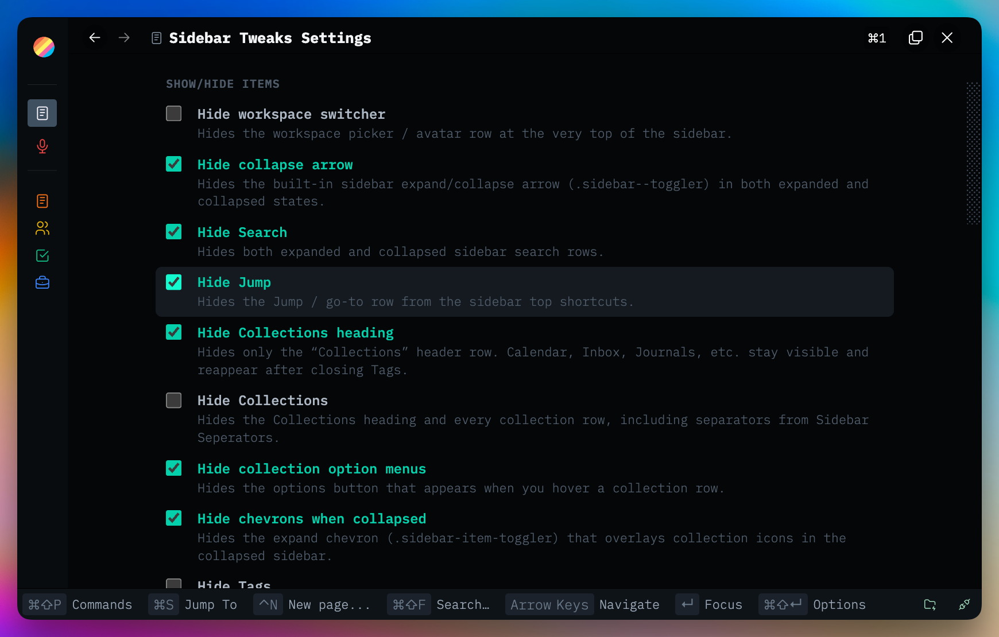

# Sidebar Tweaks

Sidebar visibility, behavior, and layout options for Thymer's collections sidebar.

Open **Plugin: Sidebar Tweaks** from the command palette, or click the sidebar icon in the status bar.

Replaces the older **Sidebar Empty Toggle** and **Sidebar Trash Hide** plugins (archived under `plugins/_archive/`). For movable theme-colored separators, see <a href="../sidebar-separators/" target="_blank" rel="noopener noreferrer">Sidebar Separators</a>.

Plugins are made with 🤍 for the Thymer community. Free to use, fork, and hack on for <a href="LICENSE" target="_blank" rel="noopener noreferrer">non-commercial use</a>.

Plug-ins take effort, hours, and credits to build. If you find them helpful for you and your workflows, a star ⭐ on the repo, a <a href="https://buymeacoffee.com/akaready" target="_blank" rel="noopener noreferrer">coffee</a> ☕, and a link back to <a href="https://akaready.com" target="_blank" rel="noopener noreferrer">@akaready</a> 🔗 all go a long way. Optional of course, but always appreciated.

Enjoy! 🙏

  

&nbsp;

## 📦 Install

**Recommended:** Use the [Thymer Plugins Manager](https://github.com/ahpatel/thymer-plugins-manager) and install via [this repo's URL](https://github.com/akaready/thymer-sidebar-tweaks) for automatic updates.

**Manual:** copy <a href="plugin.js" target="_blank" rel="noopener noreferrer"><code>plugin.js</code></a> and <a href="plugin.json" target="_blank" rel="noopener noreferrer"><code>plugin.json</code></a> from this repo into Thymer's plugin editor.

&nbsp;

## ✨ What It Does

### Show/hide items

Listed top → bottom as in the sidebar: collapse arrow, Search, Jump, Collections, collection option menus, Tags, Trash.

### Behavior

- Click empty sidebar to collapse/expand (on by default)
- Pin Tags to bottom
- Show calendar — a month calendar in the sidebar; click a day to open its Journal (see Credits)

### Layout

Panel-animation toggle, plus optional tuned widths: collapsed sidebar, expanded sidebar, and right-click context menu.

&nbsp;

## 🙌 Credits

The **Show calendar** widget is by <a href="https://github.com/gitdaveuk" target="_blank" rel="noopener noreferrer">Dave (@gitdaveuk)</a>, integrated with credit and thanks from his <a href="https://github.com/gitdaveuk/thymer-sidebar-calendar" target="_blank" rel="noopener noreferrer">thymer-sidebar-calendar</a> plugin — check it out standalone if you just want the calendar. 🗓️

&nbsp;

## 📊 Anonymous Usage Counter

This plugin pings a <a href="https://www.goatcounter.com/" target="_blank" rel="noopener noreferrer">privacy-respecting counter</a> on first install and once per day of active use. It exists so I can see which plugins are worth continuing to invest in — both "did anyone install it" and "is anyone still using it after a week." Combined with the coffee donations, this is what tells me whether to keep building. It tracks the plugin slug only, no other telemetry or user data, and you can see exactly what I see on the <a href="https://thymer-plugins.goatcounter.com" target="_blank" rel="noopener noreferrer">public dashboard</a>.

**Opt out:** Do Not Track, or `localStorage.setItem('tps-telemetry-opt-out','1')` in the console.
